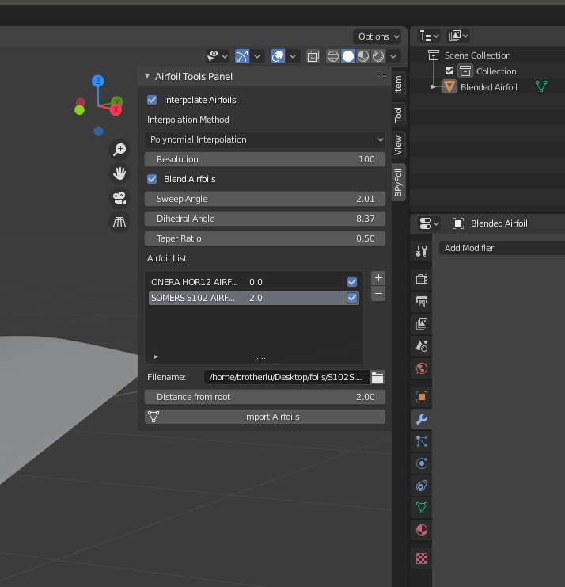

# BPyAirfoil

## Information

Updated to support 2.83 LTS

- Blender Addon to import [UIUC](https://m-selig.ae.illinois.edu/ads/coord_database.html) Airfoil DAT files.
- Also had the ability to create mulisection airfoil wings, useful for BWB and Flying Wing designs.

## Use it

The plugin is simple to use, and clear.

It can be found under the UI Tools Panel of the 3D View

## Installation

### Windows

Install plugin into the folder

C:\Users\{user profile}\AppData\Roaming\Blender Foundation\Blender\{user folder}\scripts\addons

### Linux

You can install the plugin in the Home folder

$HOME/.config/blender/{version}/

## All Else Fails

Copy Paste the code in the bpyFoil.py foil into the Script editor and run it